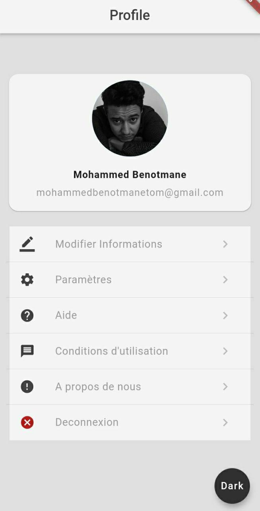
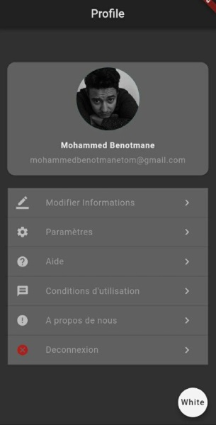

# Profile-UI-Dark-Theme

## Description:
This is an app made with flutter, it's a profil UI with Dark And White theme.
The changing of the theme is by clicking on the floating button.

## ScreenShot:
### White Theme:

### Dark Theme:

## Tools & languages:
* Android Studio
* Flutter
* Dart

## Contribution:
Feel free to fork this project and add whatever you like. If you have any suggestions or any comments please feel free to contact me or to open an issue.

## Team:
[Jetlighters](https://github.com/JetLightStudio) having fun.

